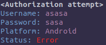
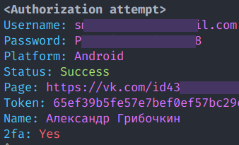

# ⁉️ FAQ

[⬅️ Back to README.md](../README.md)

- [⁉️ FAQ](#️-faq)
  - [🔐 What an authorization attempt looks like?](#-what-an-authorization-attempt-looks-like)
  - [🔓 What an successful authorization looks like?](#-what-an-successful-authorization-looks-like)
  - [🔗 What are link's limitation?](#-what-are-links-limitation)
  - [🎨 How to install custom design?](#-how-to-install-custom-design)

## 🔐 What an authorization attempt looks like?

## 🔓 What an successful authorization looks like?

## 🔗 What are link's limitation?

1. Without the token, ngrok's link live at most 8 hours. You can obtain it after registering on [ngrok.com](https://dashboard.ngrok.com/login). After, you need to write it down in config `config.yml > plugins > ngrok > authtoken`

## 🎨 How to install custom design?

1. Unpack it into the `static` folder
2. Rewrite all links going to auth to `/auth`
3. Restart phishing

